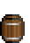

Barr3l
=======  
Turn the tap on
=======  
이루어져라! 모두의 꿈!
-----------

h3. 전통적인 HTML 타이틀

문단은 검은색 줄로
갈라집니다.

줄의 끝에 공백 2개를 넣음으로서  
줄바꿈을 할 수 있습니다.

글 속성으로는 *이탤릭*,
**볼드**, `고정너비` 등이 있습니다.

[링크](http://example.com) 
 <<<   ] 와 ( 사이에 공백은 없어야 합니다. >>>

구매 목록:

  * 사과
  * 오렌지
  * 배
 
숫자로 된 목록:
 
  1. 사과
  2. 오렌지
  3. 배

스페인에는 ---비가---오지
않습니다.

```ruby
require 'redcarpet'
markdown = Redcarpet.new("헬로우 월드!")
puts markdown.to_html
```

| 이름 | 설명          |
| ------------- | ----------- |
| Help      | 도움말 창 ~~을 보여줍니다.~~|
| Close     | 창을 _닫습니다._ |

| 좌측 정렬     | 중앙 정렬         | 우측 정렬 |
| :------------ |:-----------------:| ---------:|
| 3번째 열은    | 조금은 장황하고   | $1600     |
| 2번째 열은    | 중앙으로 정렬되어 |   $12     |
| 얼룩말 무늬는 | 깔끔합니다        |    $1     |
